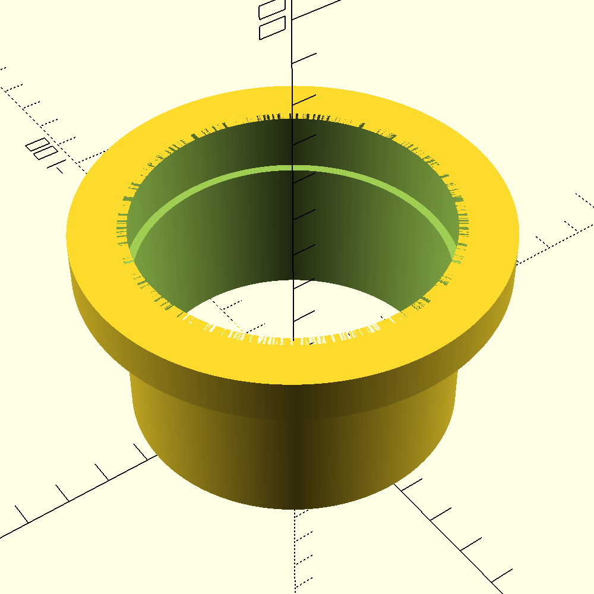
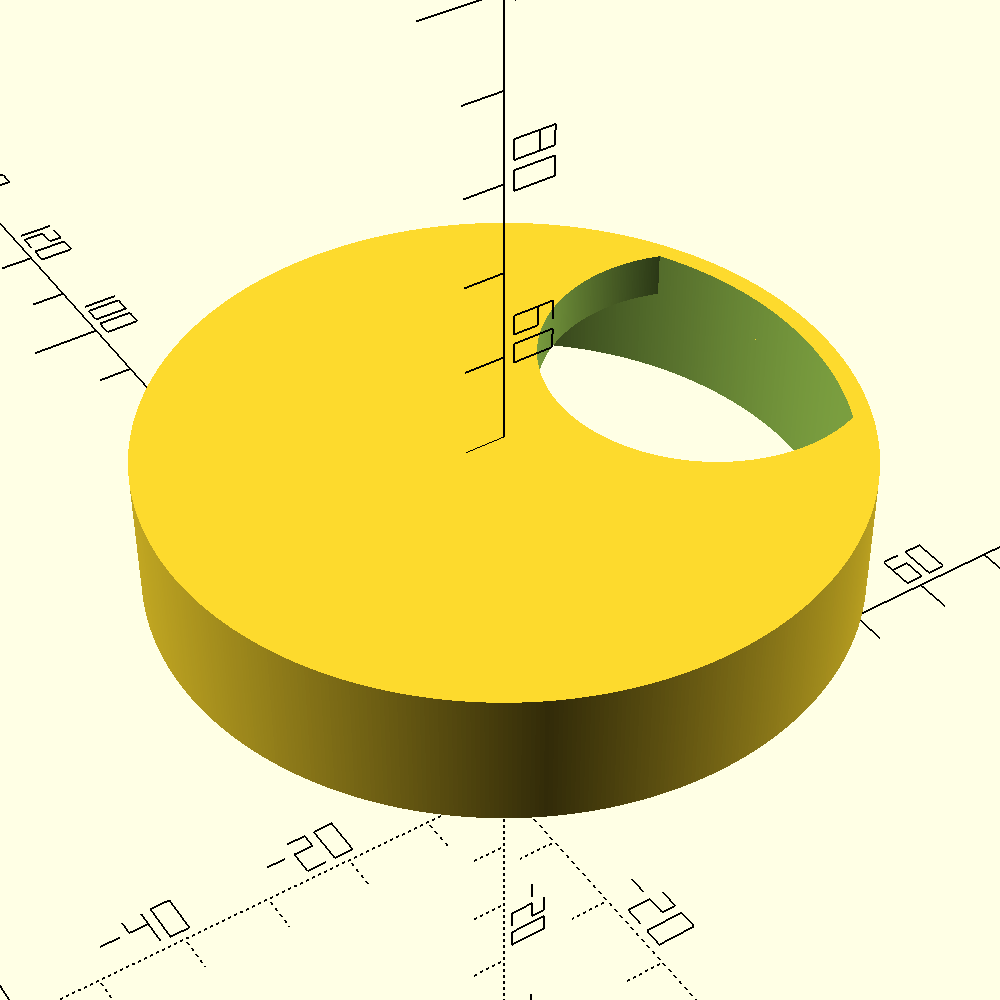

After seeing the workshop team use 3D printers to create COVID-19 desk dividers and standard cable grommets for the office, I noticed the existing models didn't quite fit my specific desk requirements. I designed this custom version to better suit my cable management needs.

## Design

The grommet is a two-part assembly consisting of a main sleeve and a removable lid. The sleeve is designed to fit snugly into a pre-drilled desk hole, while the lid features a cable pass-through slot. I provided the workshop team with these models, which they printed for use at my workstation.

## Gallery

