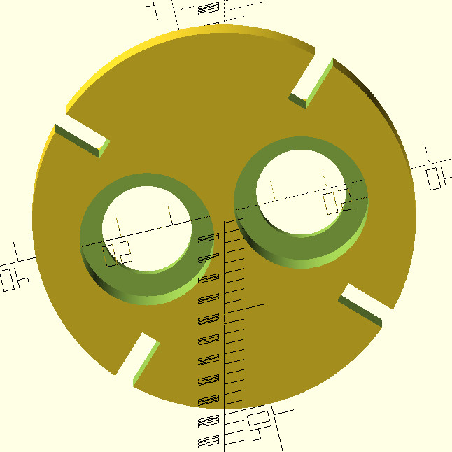
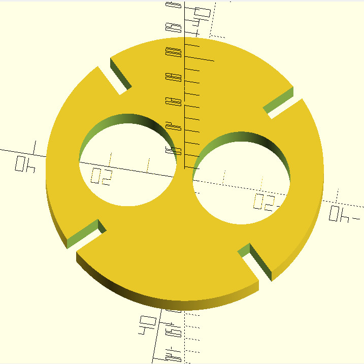

The rocket we were launching was designed for larger booster motors than we could get locally. Rather than redesign the whole chassis, I modelled a custom two-part motor mount to hold the smaller available boosters securely in their place.

## Design

The mount is a two-part assembly. The bracket is a flat cylinder with two bored holes sized for the booster casings. The base is the same geometry but adds a retaining lip at one end — the boosters push against it under thrust so they can't travel through the mount. Both parts share a common variables file so booster dimensions only need updating in one place.

## Gallery

